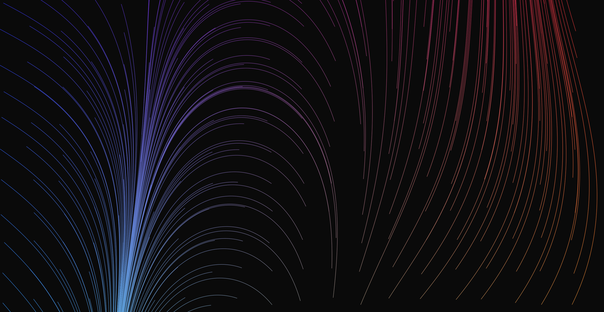

# Hack Technology / Project Attempted

## What you built? 

I've always loved the visual arts and doing creative art projects, whether that's painting, sketching, or etching. For this project, I was excited about generative art and wanted to explore technologies that allow developers to express their creativity through code. I was fascinated by the idea of having an relatively autonomous system with some randomness produce really interesting art.

I built a react-based gallery, showing various generative art pieces in a horizontal scroll.

Screenshots.
[How?](https://help.github.com/articles/about-readmes/#relative-links-and-image-paths-in-readme-files)

(More to come)
## Who Did What?

Worked on my own.

## What you learned

There are lots of technologies for generative art. Before picking a tech stack, I did some experimentation and research around the pros and cons of each and the relative ease to pick up. I found `Processing` which is an interesting technology that is meant to make visual, interactive applications extremely easy to write. It comes with it's own IDE and has various language supports, such as python,java and javascript,.

There are other technologies like 
* `Paper.js` -  an open source vector graphics scripting framework that runs on top of the HTML5 Canvas.
* `p5.js` - a javascript libary built on top of processing
* `Cinder`- a cross platform C++ library (Mac OS X, Windows) for programming with aesthetic intent used for programming graphics, audio, video, networking, image processing and computational geometry. Cinder is cross-platform, and in general the exact same code works under Mac OS X, Windows

I also got the chance to work with react, leveraging a react wrapper for `p5.js` called [`react-p5-wrapper`](https://github.com/jamesrweb/react-p5-wrapper).

## Authors

Elorm Coch - Individual project

## Acknowledgments

[Particle Effects](https://youtu.be/H-9jCNhLe-Q)

[Flow Field](https://youtu.be/1-QXuR-XX_s)

## How to run 
### `cd p5-playground && npm install && npm start`

Runs the app in the development mode.\
Open [http://localhost:3000](http://localhost:3000) to view it in the browser.